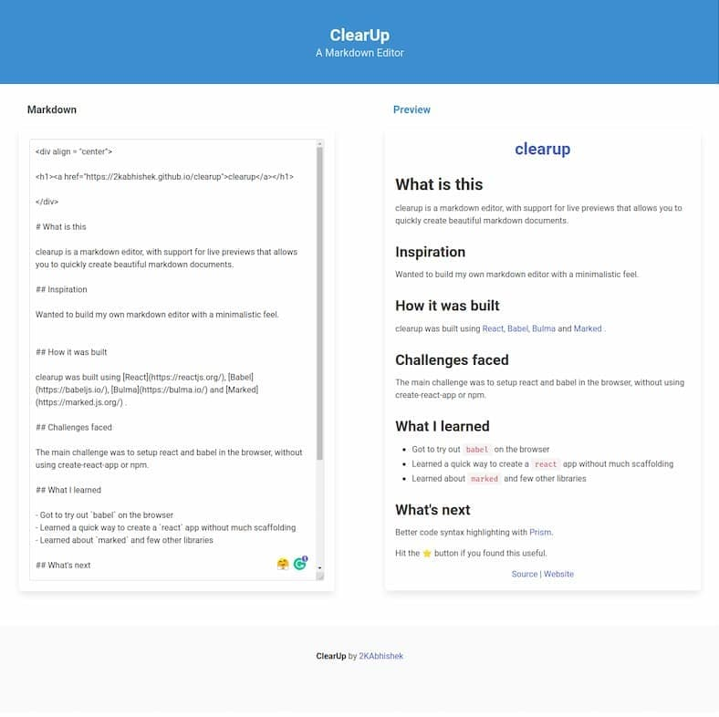

<div align = "center">

<h1><a href="https://2kabhishek.github.io/clearup">clearup</a></h1>

<a href="https://github.com/2KAbhishek/clearup/blob/main/LICENSE">
 </a>

<a href="https://github.com/2KAbhishek/clearup/graphs/contributors">
 </a>

<a href="https://github.com/2KAbhishek/clearup/stargazers">
</a>

<a href="https://github.com/2KAbhishek/clearup/network/members">
 </a>

<a href="https://github.com/2KAbhishek/clearup/watchers">
 </a>

<a href="https://github.com/2KAbhishek/clearup/pulse">
 </a>

<h3>Clearup your markdown ✒️🤓</h3>

<figure>
  
  <br/>
  <figcaption>clearup screenshot</figcaption>
</figure>

</div>

## What is this

clearup is a markdown editor, with support for live previews that allows you to quickly create beautiful markdown documents.

## Inspiration

Wanted to build my own markdown editor with a minimalistic feel.

## Prerequisites

Before you begin, ensure you have met the following requirements:

- You have installed the latest version of `any web browser`

## Getting clearup

To install clearup, follow these steps:

```bash
git clone https://github.com/2kabhishek/clearup
cd clearup
```

## How it was built

clearup was built using [React](https://reactjs.org/), [Babel](https://babeljs.io/), [Bulma](https://bulma.io/) and [Marked](https://marked.js.org/) .

## Challenges faced

The main challenge was to setup react and babel in the browser, without using create-react-app or npm.

## What I learned

- Got to try out `babel` on the browser
- Learned a quick way to create a `react` app without much scaffolding
- Learned about `marked` and few other libraries

## What's next

Better code syntax highlighting with [Prism](https://prismjs.com/).

Hit the ⭐ button if you found this useful.

## More Info

<div align="center">

<a href="https://github.com/2KAbhishek/clearup">Source</a> | <a href="https://2kabhishek.github.io/clearup">Website</a>

</div>
